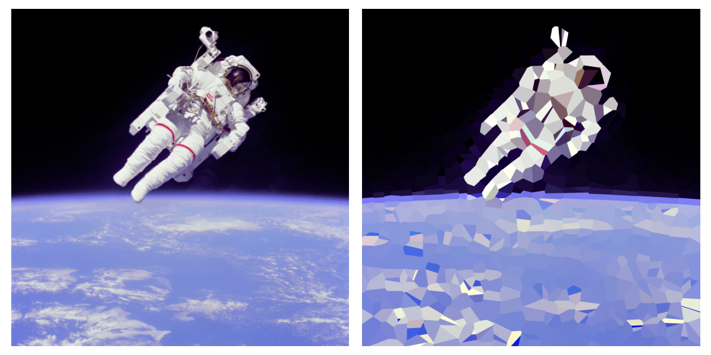
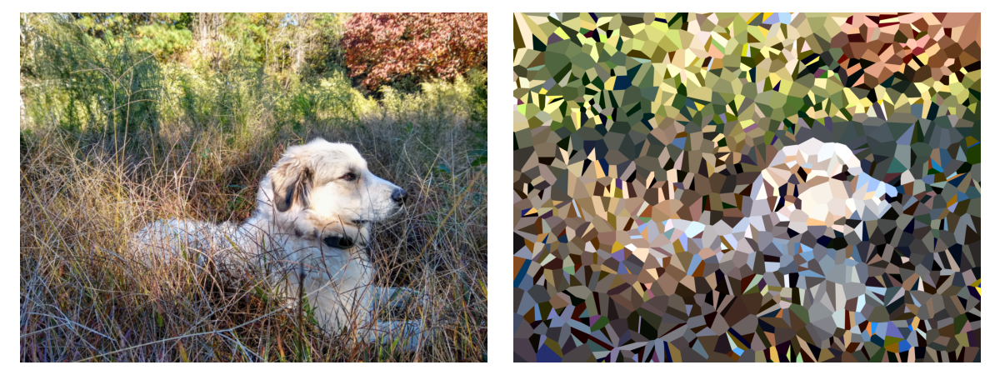
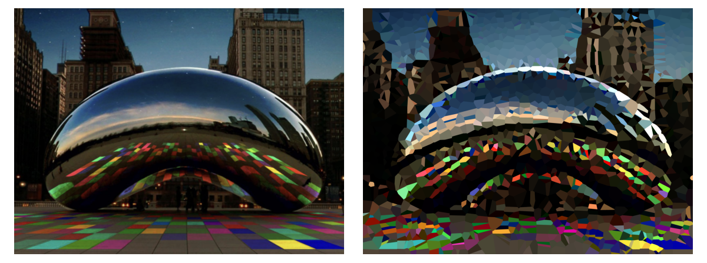
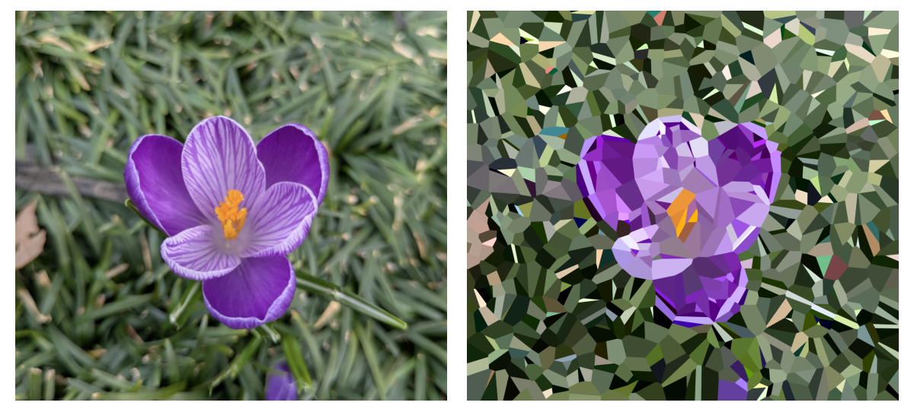
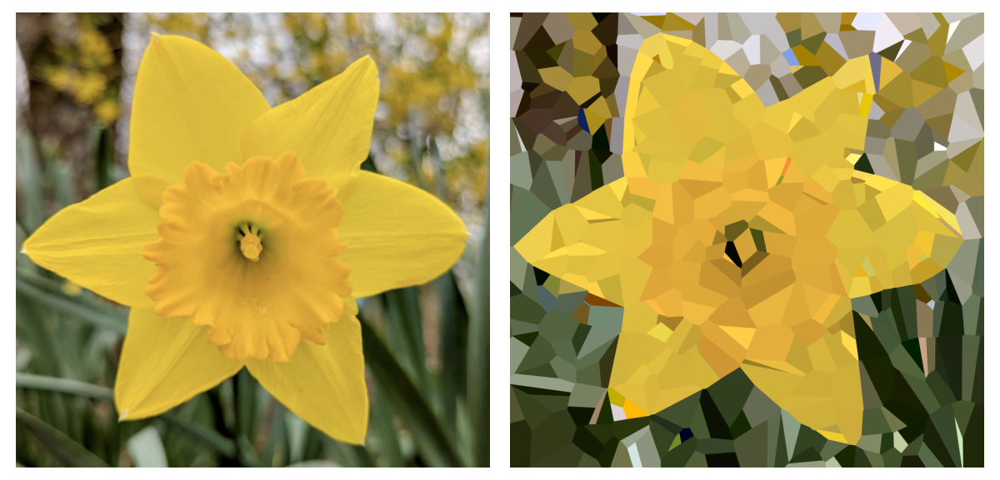
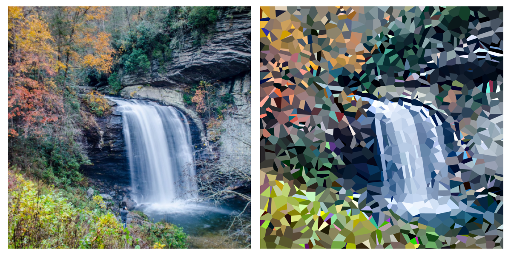
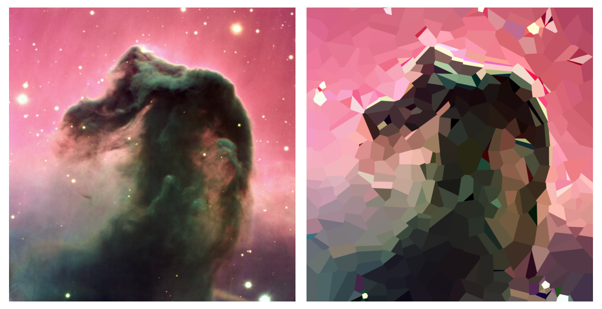
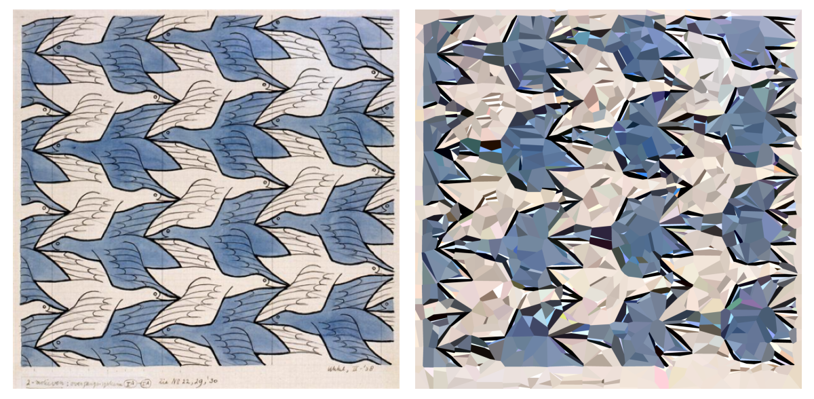

# Voronoi Stained Glass




This project uses Voronoi tessellation to transform images into beautiful stained glass-like artwork.

## Usage
```bash
python stained_glass.py input/astronaut.jpg

# Run with custom configuration
python stained_glass.py input/astronaut.jpg --config custom_config.yaml
```

## Installation

Clone the repository:
```bash
git clone https://github.com/yourusername/voronoi-stained-glass.git
cd voronoi-stained-glass
```
Dependencies are specified in `environment.yml`. 
```bash
# this creates the 'voronoi' environment with all dependencies
conda env create -f environment.yml

# Activate the environment
conda activate voronoi
```

## Configuration

The script uses a YAML configuration file to control various aspects of the rendering. A default configuration file (`stained_glass_config.yaml`) is included in the repository.

Key configuration parameters:

- `voronoi/num_cells`: Number of Voronoi cells (higher values create more detailed output)
- `image/min_dimension`: Minimum dimension for resizing the input image while preserving aspect ratio. Larger values produce sharper results but lead to much longer computation times. This value should be greater than or equal to 65 for the default `ssim_window_size` of 5 pixels.
- `output/dir`: Output directory where all results will be saved

## How It Works

The algorithm uses a 2D Voronoi tessellation with associated color vectors for each cell. It then:

1. Initializes random cell positions and colors
2. Renders the current state using k-nearest neighbor weighted color blending
3. Computes the difference between the rendered image and the target
4. Optimizes both cell positions and colors to minimize this difference
5. Repeats for a fixed number of iterations

The optimization process gradually reduces the "temperature" parameter (sigma), leading to sharper cell boundaries as the process continues.

This gif shows the Voronoi tesselation during training for the astronaut example with 300 centroids. By the end, the line between earth and space can clearly be seen. 

*Evolution of the astronaut image during optimization*

## Output Files

| File | Description |
| ---- | ----------- |
| `voronoi_nearest_neighbor_final.png` | Final Voronoi diagram with hard cell boundaries |
| `final_comparison.png` | Side-by-side comparison of the target image and the Voronoi approximation |
| `rendered_final.png` | Final rendered image using weighted k-nearest neighbors for smooth transitions |
| `centroids_evolution.gif` | Shows how the Voronoi cell positions and colors evolve |
| `comparison_evolution.gif` | Side-by-side comparison evolution |
| `results.txt` | Contains detailed log information with loss metrics for each saved iteration |
| `loss_history.png` | Graph showing how MSE, SSIM and combined loss evolve during training |
| `models/voronoi_model_final.pt` | Saved PyTorch model containing the optimized Voronoi parameters |

## Gallery
Great Pyrenees Dog - 1,500 Centroids <br>


The Bean, Downtown Chicago - 2,000 Centroids <br>


Crocus Vernus - 1,000 Centroids <br>


Daffodil - 500 Centroids <br>


Looking Glass Falls, North Carolina - 1,500 Centroids <br>


Horsehead Nebula - 500 Centroids <br>


Two Brids by Escher - 2000 Centroids <br>

